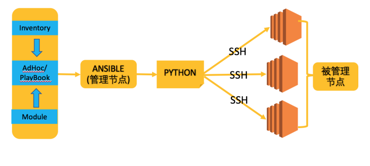
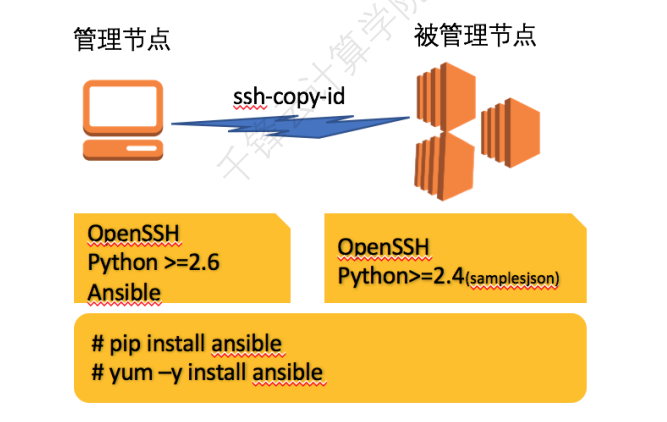

### 1. 介绍
  Ansible 是⼀个 IT ⾃动化⼯具。它能配置系统、部署软件、编  
排更复杂的 IT 任务，如连续部署或零停机时间滚动更新。  
Ansible ⽤ Python 编写，尽管市⾯上已经有很多可供选择的  
配置管理解决⽅案（例如 Salt、Puppet、Chef等),但它们各有优  
劣，⽽Ansible的特点在于它的简洁。让 Ansible 在主流的配置管理  
系统中与众不同的⼀点便是，它并不需要你在想要配置的每个节点上安  
装⾃⼰的组件。同时提供的另⼀个优点，如果需要的话，你可以在不⽌  
⼀个地⽅控制你的整个基础架构。  

### 2. ⼯作原理

1、在ANSIBLE 管理体系中，存在"管理节点" 和 "被管理节点" 两  
种⻆⾊。  
2、被管理节点通常被称为"资产"  
3、在管理节点上，Ansible将 AdHoc 或 PlayBook 转换为Python  
脚本。  
并通过SSH将这些Python 脚本传递到被管理服务器上。  
在被管理服务器上依次执⾏，并实时的将结果返回给管理节点  

### 3. 如何安装

ansible all -i 10.0.0.100,10.0.0.101,10.0.0.102 -m ping